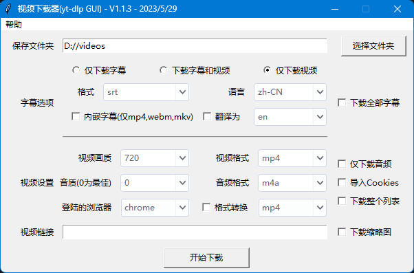

# 简易视频/字幕下载软件
[](https://github.com/Guojingxing/yt-dlp-simple-gui/blob/main/LICENSE)
[](https://github.com/Guojingxing/yt-dlp-simple-gui/releases/latest)
[](https://github.com/Guojingxing/yt-dlp-simple-gui/releases/tag/v1.1.3)


该脚本为[`yt-dlp`](https://github.com/yt-dlp/yt-dlp)命令的简易可视化界面。无需安装，打开软件粘贴视频链接，点击“开始下载”或按`Enter`键即可下载视频。

<details>
<summary><h3>软件截图</h3></summary>


</details>

## 系统要求
系统要求 | 说明
-|-
操作系统 | Windows 7及以上
其他软件 | **ffmpeg（重要，必须安装）**

### ffmpeg安装、配置环境变量

1. 从[ffmpeg官网](https://www.ffmpeg.org/download.html#get-sources)下载并解压ffmpeg。

2. 打开“编辑系统环境变量”设置。

3. 在系统变量中找到名为“Path”的变量，点击“编辑”。

4. 添加ffmpeg的安装目录路径（例如：“C:\path\to\ffmpeg”）。

5. 确认更改并关闭窗口。重启计算机或打开新的命令提示符以使环境变量生效。

## 主要功能
- **视频下载**：可指定任意画质的视频（最高可支持YouTube 8K）以及音频，支持下载播放列表和缩略图
- **支持大多数视频网站**：支持**哔哩哔哩、YouTube、优酷、抖音**等几乎所有视频网站，详见[支持的网站](https://github.com/yt-dlp/yt-dlp/blob/master/supportedsites.md)
- **支持关键词搜索**：在视频链接处输入搜索关键词，可下载YouTube中最匹配的视频
- **字幕下载**：可下载指定语言和格式的字幕文件（若有），勾选“字幕翻译”即可翻译为想要的语言
## 使用教程
下载软件，无需安装，打开后粘贴视频链接，直接点击“开始下载”或按`Enter`键即可开始下载。
### 注意事项
- **导入Cookie**：对于部分需要登录或者开通会员才能看的视频，可能需要勾选导入Cookie后才可下载（[V1.1.2版本](https://github.com/Guojingxing/yt-dlp-simple-gui/releases/tag/v1.1.2)及以后）
- **下载短视频**：由于视频画质为视频最大高度，那么下载抖音、YouTube Shorts或其他短视频时，视频画质应选择大于1920的数字
- **默认当前文件夹**：下载文件夹选填，默认下载至当前软件所在目录的`videos`下
- **下载弹幕**：若要下载B站等弹幕网站的弹幕文件，勾选“下载全部字幕”即可
- **字幕翻译和自动生成字幕**：除YouTube外，并非所有网站都支持字幕翻译；若要下载自动生成字幕，视频首先得有自动字幕，然后在语言代码后添加`orig`，如：`en-orig`（英语自动生成字幕）
## 自编译exe文件
### python模块安装
请确保电脑安装了以下python模块：`yt-dlp`、`ttkthemes`。执行以下命令安装：
```bat
pip install yt-dlp ttkthemes
```
在项目目录下，执行以下命令运行：
```bat
python .\yt-dlp-simple-gui.py
```
或者执行以下代码将其封装成`exe`文件使用（需要`pyinstaller`），封装后的`exe`文件在`dist`目录下：
```bat
pip install pyinstaller
pyinstaller -F --onefile .\yt-dlp-simple-gui.py --paths C:\users\dell\appdata\local\programs\python\python310\lib\site-packages\yt-dlp,websockets,pycryptodomex,brotli,certifi,mutagen,ttkthemes,pillow --clean
```
### 不压缩
在项目目录下，执行以下命令可将结果打包成单个可执行文件`yt-dlp-simple-gui.exe`（包含所有依赖）：
```bat
pip install yt-dlp pyinstaller ttkthemes pyinstaller-versionfile
create-version-file metadata.yml --outfile versioninfo.txt
pyinstaller -F --onefile .\yt-dlp-simple-gui.py -i download_icon.ico --version-file=versioninfo.txt --paths C:\users\dell\appdata\local\programs\python\python310\lib\site-packages\yt-dlp,websockets,pycryptodomex,brotli,certifi,mutagen,ttkthemes,pillow --clean
```
若要提高exe启动和加载速度，可打包成文件目录：
```bat
pyinstaller -F --onedir .\yt-dlp-simple-gui.py -i download_icon.ico --version-file=versioninfo.txt --paths C:\users\dell\appdata\local\programs\python\python310\lib\site-packages\yt-dlp,websockets,pycryptodomex,brotli,certifi,mutagen,ttkthemes,pillow --clean
```
此时所有结果都被打包到一个文件夹中，该文件夹包括一个可执行文件`yt-dlp-simple-gui.exe`和可执行文件执行时需要的依赖文件（默认）。
### 使用虚拟环境和UPX压缩
执行以下代码：
```bat
pip install pipenv
pipenv install
pipenv shell
```
等到虚拟环境启动后，再执行以下代码：
```bat
pip install yt-dlp pyinstaller ttkthemes pyinstaller-versionfile
create-version-file metadata.yml --outfile versioninfo.txt
```
以下两行代码二选一：
```bat
:: 生成单个可执行文件exe
pyinstaller -F --onefile .\yt-dlp-simple-gui.py -i download_icon.ico --version-file=versioninfo.txt --paths C:\users\dell\appdata\local\programs\python\python310\lib\site-packages\yt-dlp,websockets,pycryptodomex,brotli,certifi,mutagen,ttkthemes,pillow --clean
::生成文件目录（可打包成zip）
pyinstaller -F --onedir .\yt-dlp-simple-gui.py -i download_icon.ico --version-file=versioninfo.txt --paths C:\users\dell\appdata\local\programs\python\python310\lib\site-packages\yt-dlp,websockets,pycryptodomex,brotli,certifi,mutagen,ttkthemes,pillow --clean
```
然后将`UPX.exe`复制到`pyinstaller.exe`同文件夹下。修改`pyinstaller`产生的`.spec`文件，将`upx=False`改成`upx=True`，然后执行以下代码：
```bat
:: (若已为True, 则跳过此行)
pyinstaller yt-dlp-simple-gui.spec

pipenv --rm
exit
```
